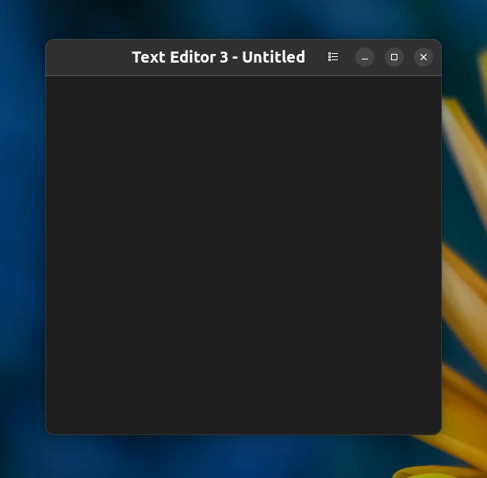
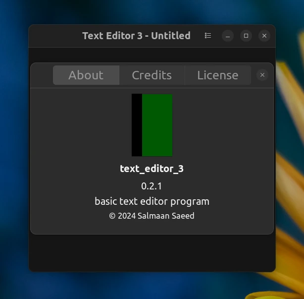

# Text Editor 3

Basic text editor program written in rust using gtk4 rust key bindings.





## Dependencies
* libgtk-4-dev
* build-essential

Command:
```
sudo apt install libgtk-4-dev build-essential
```

Check this page to install dependencies in other linux distros:
[Linux Installation](https://gtk-rs.org/gtk4-rs/stable/latest/book/installation_linux.html)

## Crates:
* [gtk4](https://crates.io/crates/gtk4)
* [gdk4](https://crates.io/crates/gdk4)
* [glib-macros](https://crates.io/crates/glib-macros)
* [gio](https://crates.io/crates/gio)
* [gdk-pixbuf](https://crates.io/crates/gdk-pixbuf)

## Building Calculator app

Build and run the application
```
cargo run
```

## Install the app on Linux

Install the application
```
cargo install --path .
```

Run the executable
```
calculator
```
